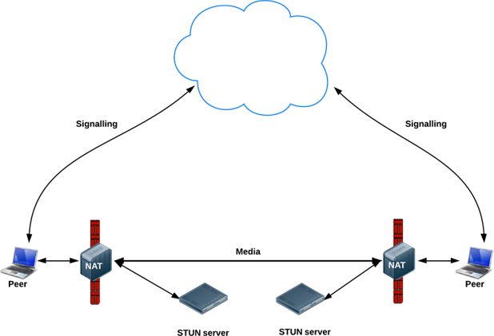
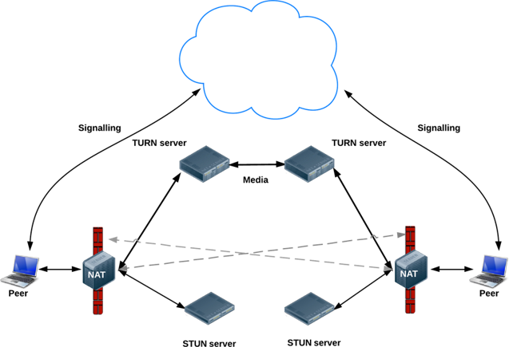
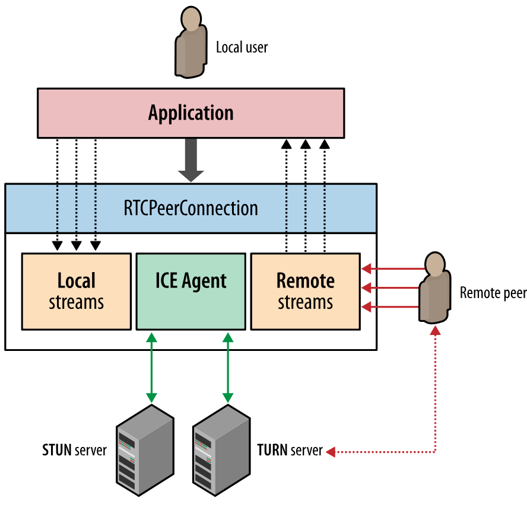

# Build cross-browser WebRTC video call using rtcio

This article is mainly discussing about chrome (on laptop and Andriod) and safari (on Mac and IOS).

## Intro to WebRTC

**WebRTC** is a free, open project that provides browsers and mobile applications with Real-Time Communications (RTC) capabilities via simple APIs. It's a pure P2P technology with always encryption. It can send and receive video, audio, file, screenshare, etc.

There are lots of advantages of WebRTC:

- it's free, and open source
- it's P2P
- always-on voice and video encryption
- device independence, more and more browsers are supporting it, this article will show between chrome and safari
- support multiple stream/tracks, you can change or even add camera, or add screenshare

## What are the key components

- **Signalling**: peer exchange information. Even though it's P2P, but need a machanism to send/receive data for setting up connection, also you may add authentication check in this step. That's where you should build server for.
- **ICE**: A framework that tries to setup connection. If direct network card fails, then external address obtained from STUN, if still fail then use TURN.
- **STUN**: used to get an external network address (public IP:Port)
- **TURN**: relay traffic if direct (peer to peer) connection fails. (stream traffic, e.g. video or audio)
- Every TURN server supports STUN: a TURN server is a STUN server with added relaying functionality built in

[//]: <> (stun.png or ./stun.png)

